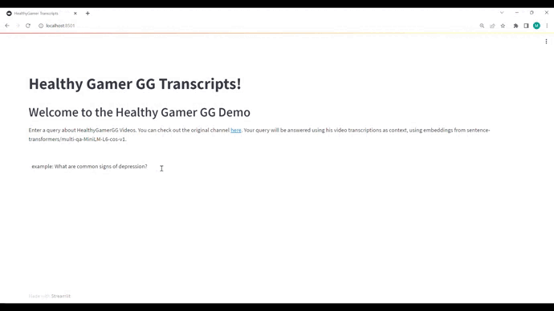

# Healthy_Gamer_Scripts
This is a demo project for performing semantic search on transcriptions from the youtube channel "HealthyGamerGG". Dr. K is a Harvard psychologist that focuses on mental health and wellness originally for twitch gaming community, but has now extended to general public. Semantic search, unlike traditional keyword search, allows users to ask questions on knowledge base and return relevant answers. The hope of this project is for users to ask questions relating to mental health and recieve relevant context with clickable links back to reference materials. The inspiration for this project came from Andrew Huberman transcripts by Aleksa Gordic - The AI Epiphany (https://www.youtube.com/watch?v=dvNJX_YYtW8&).

Note: I encorporated a project structure similar to https://github.com/prrao87/db-hub-fastapi/tree/main/dbs/elasticsearch as I really liked the layout of the code, as well as some of the ways es client was handled by Fastapi. Though through testing I found that helpers.parallel_bulk seemed much easier to incorporate. 

## Tools 
The project uses docker to run multiple containers for Elasticsearch, Python, Fastapi backend and a streamlit frontend. The ingestion script uses youtube-dl to extract audio and relevant thumbnail from youtube channel, FasterWhipser to transcribe the audio and miniqa-v6 text embedding model to encode the text into 384 dim. vectors. 

Note: Elasticsearch 8.7 is used to store/search vectors.

Hardware: The laptop used has an RTX 3070 GPU w/ 8GB VRAM. Due to memory constraints, the "tiny" model was used for FasterWhisper. Feel free to experiment with larger models if you have access to better gpus. Also if you don't have access to a GPU, I personally recommend Google Colab. 

## Run project. 
Start the docker compose project 
1. Run Docker Compose 

Create an interactive terminal of 'healthygamergg' container
2. docker exec -it healthygamergg /bin/bash 

Start main script and provide youtube url
3. python src/scripts/main.py youtube_url

Note: Healthygamergg videos average about 30+ minutes, which took about 3-5 minutes for each transcription. I also seem to have trouble transcribing videos that were longer than 4 hours. Be sure to monitor your RAM/Memory usage if transcriptions seem to fail. 

## How to Use 
Once the data is ingested, on a web browser open url to localhost:8501 (ported in docker compose file). To use the application, write a question in the space bar and hit enter to get back relevant text/ videos. clicking the text will take you the relevant video and position where the quote was said. Ideally users can use this to get additional context on returned text.

### Example Usage 

## Future Improvements 
The project can be approved in multiple ways.
1. Adding translation service - allows non-english youtube channels to be searchable 
2. Adding summarization service on returned document. 
3. Possibly incorporating langchain to provide additional context on returned documents. 

This project can be extended to multiple domains. For example could be extended to different domains (finance, education, etc.)

